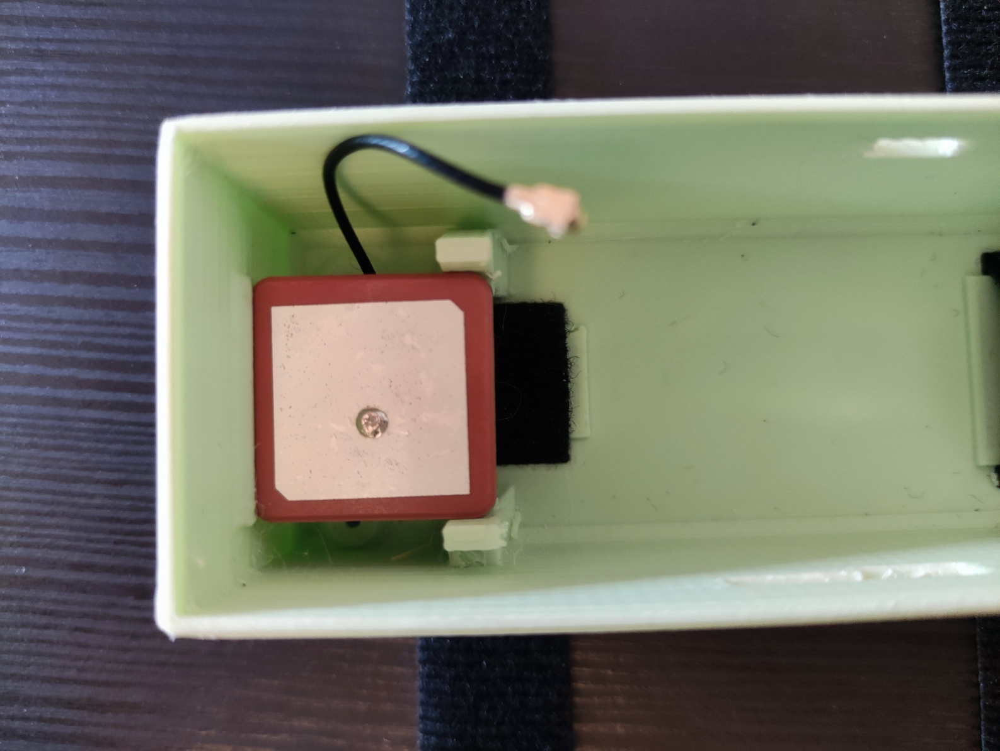
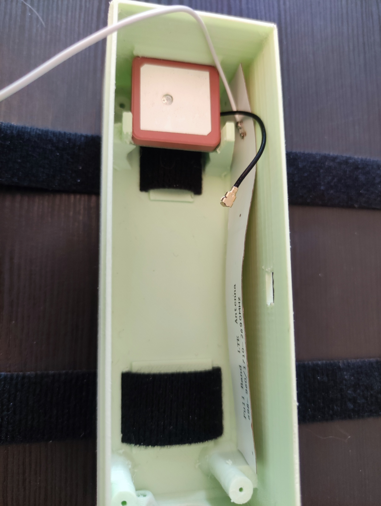
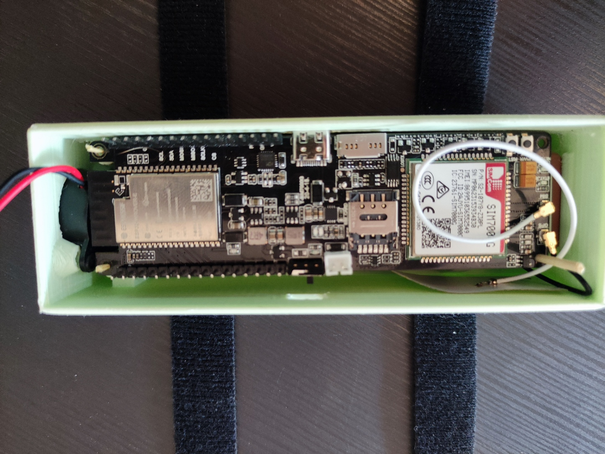
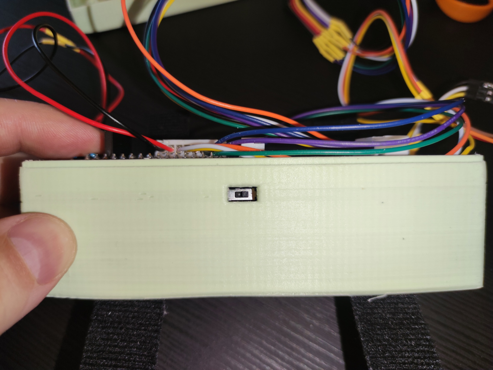
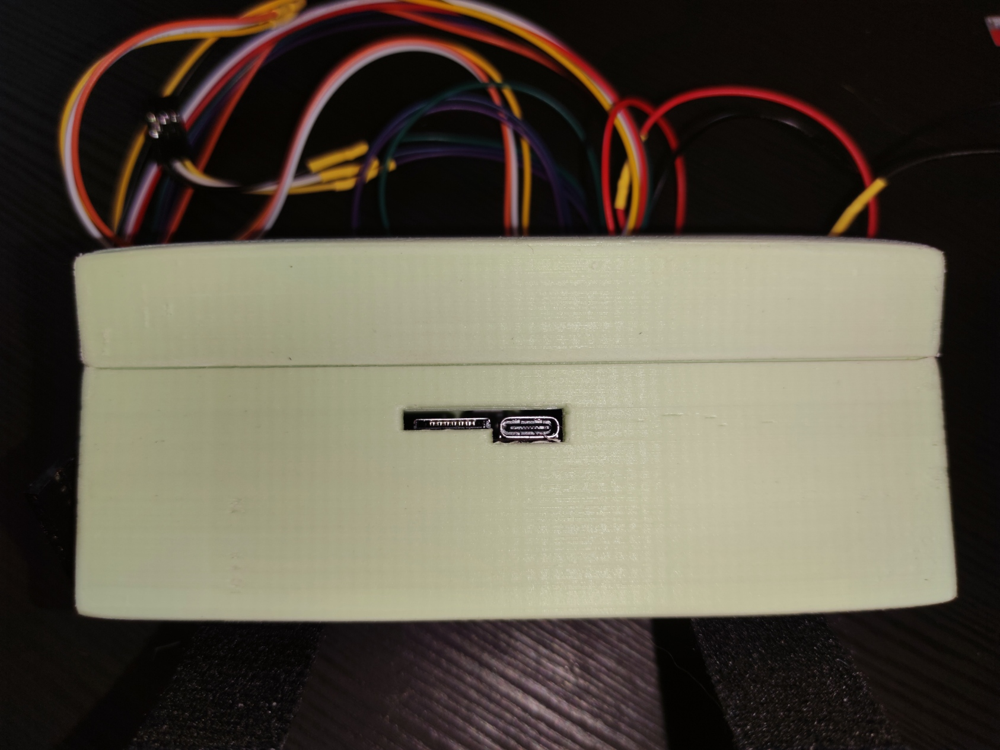

# Assemblage

Pour réussir l'assemblage de votre TrackSense, veuillez suivre les instructions suivantes:

1. Mettre les inserts filets aux endroits prévus
    > 

2. Positionner les sangles
    > 

3. Mettre l'antenne GPS
    > 

4. Mettre l'antenne LTE
    > 

5. Insérer le buzzer et le visser
    > 

6. Positionner le Lilygo et brancher les antennes (n'oubliez pas la batterie)
    > 
    > 
    > 

7. Brancher le PCB sur le Lilygo
    > 

8. Vérifier le bouton d'alimentation, l'emplacement de la carte microSD et le port USB-C
    > 
    > 

9. Placer le bitognau sur le bouton d'alimentation
    > 

10. Installer les boutons et l'écran dans le couvercle
    > 

11. Fermer le couvercle et insérer les tiges filetées
    > 

12. Visser les tiges filetées dans le couvercle
    > 

13. Visser les écrous
    > 

