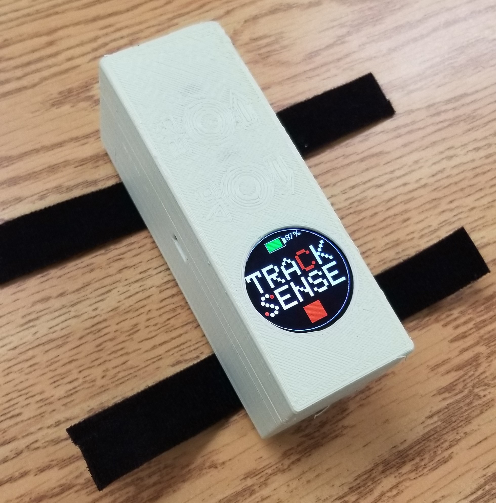
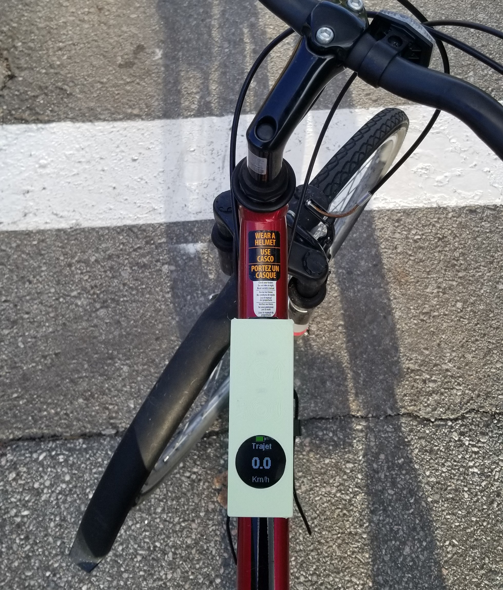

# Avertissement :
> Ce Dépôt est un "Fork" du projet d'[origine](https://github.com/DFC-Informatique-Cegep-de-Sainte-Foy/TrackSense). Le projet d'origine risque d'être repris par les prochaines cohortes. Je veux garder des traces de notre projet dans l'état ou nous l'avons laissé à la fin du cours. Il y a aussi des chances que je le poursuive un jour.

# TrackSense 

> Le projet TrackSense est développé par des étudiants du programme [Techniques de l'informatique - Programmation, bases de données et serveurs - DEC accéléré](https://dfc.csfoy.ca/retourner-aux-etudes/programmes-a-temps-plein/informatique/techniques-de-linformatique-programmation-bases-de-donnees-et-serveurs-dec-accelere/) du cégep de Ste-Foy, dans le cadre de leur projet de synthèse de la session Automne 2023.

    

> - TrackSense est un boitier à fixer sur votre vélo pour enregistrer vos trajets.
> - L'application mobile permet la récupération, l'affichage et la sauvegarde des trajets. Elle sert également à la configuration du TrackSense.
> - L'API (serveur Web) est l'interface permettant de sauvegarder et récupérer les trajets.
> - La base de données sert à sauvegarder les données.

**Visionnez une démonstration sur youtube**

 

    

> Le présent dépôt rassemble les informations générales et tout ce qui n'est pas du développement des applications (embarquée, mobile, Web, Base de données). Chaque application à son dépôt.

## Créer votre TrackSense !

> Pour garantir le bon fonctionnement de votre TrackSense, de sa communication avec votre application mobile et la sauvegarde de vos données, veuillez suivre les étapes [disponibles ici](https://github.com/DFC-Informatique-Cegep-de-Sainte-Foy/TrackSense/wiki) !

    

## Application embarquée

> L'application embarquée est le programme qui va s'exécuter à l'intérieur de votre TrackSense.
> Vous trouverez son dépôt GitHub [ici](https://github.com/DFC-Informatique-Cegep-de-Sainte-Foy/420-W57-SF_E23_4394_TrackSense_AppEmbarque).

    

## Application mobile

> L'application mobile est nécessaire pour configurer et communiquer avec votre TrackSense.
> Vous trouverez son dépôt GitHub [ici](https://github.com/DFC-Informatique-Cegep-de-Sainte-Foy/420-W57-SF_E23_4394_TrackSense_AppMobile).

    

## Application Web (API)

> L'application Web est l'interface qui vous permet de communiquer avec votre base de données. Elle peut être hébergée en ligne ou chez vous.
> Vous trouverez son dépôt GitHub [ici](https://github.com/DFC-Informatique-Cegep-de-Sainte-Foy/420-W57-SF_E23_4394_TrackSense_ServeurWeb).

## Base de données

> La base de données est l'endroit où sont stockées vos données. Elle n'est accessible que via l'application Web.
> Vous trouverez son dépôt GitHub [ici](https://github.com/DFC-Informatique-Cegep-de-Sainte-Foy/420-W57-SF_E23_4394_TrackSense_BD).

## Manuel utilisateur

> Comment utiliser mon TrackSense ? Quelles sont les fonctionnalités ? Ça fait quoi quand j'appuie sur un bouton ?
> Pour avoir toutes les réponses à ces questions et bien d'autres, vous trouverez le manuel de l'utilisateur [ici](https://github.com/DFC-Informatique-Cegep-de-Sainte-Foy/TrackSense/wiki/Manuel) !  

## Informations générales

    

> Quelques informations et/ou éléments supplémentaires :
> - [Logo](./TrackSense/tree/main/Logo/)
> - [Composants](./TrackSense/tree/main/Composants)

## Contributeurs

### Session été 2023

>-  [Dominique Lebrun](https://github.com/dodo-12-37)
>-  [Loïc Delas](https://github.com/LoicDelas)
>-  [Tien Binh Nguyen](https://github.com/binhnguyen84)
>-  [Simon Quillaud](https://github.com/simonquillaud)
